= Internos de conjuntos y diccionarios

Los tipos `dict` y `set` de Python están construidos sobre tablas de hash.
Esta publicación explica cómo el uso de tablas de hash determina
las fortalezas y limitaciones de esos tipos de contenedores.

Algunas preguntas que este artículo responde:

* ¿Qué tan eficientes son `dict` y `set` en Python?
* ¿Por qué los elementos de `set` no tienen un orden definido?
* ¿Por qué no podemos usar cualquier objeto de Python como clave de `dict` o elemento de `set`?
* ¿Por qué el orden de las claves del `dict` depende del orden de inserción?

Contenido:

* <<perf_experim_sec>>
* <<hashes_and_equality>>
* <<set_hash_tables_under_sec>>
** <<hash_table_algorithm_sec>>
** <<consequences_set_sec>>
* <<hash_table_in_dict_sec>>
** <<key_sharing_dict_sec>>
** <<how_compact_dict_ordering_sec>>
** <<consequences_dict_sec>>

[NOTE]
=====
No necesitas conocer todos estos detalles para hacer buen uso de diccionarios y conjuntos.
Pero las ideas de implementación son hermosas—por eso las describo.
Para consejos prácticos, puedes ir directamente a <<consequences_set_sec>> y <<consequences_dict_sec>>.
=====

Para motivar el estudio de las tablas de hash, comenzamos mostrando el increíble rendimiento de `dict` y `set` con una prueba sencilla que involucra millones de elementos.

[[perf_experim_sec]]
== Un experimento de rendimiento

Por experiencia, todos los programadores de Python saben que los diccionarios y conjuntos son rápidos. Lo confirmaremos con un experimento controlado.

Para ver cómo el tamaño de un `dict`, `set` o `list` afecta el rendimiento de la búsqueda con el operador `in`, generé un array de 10 millones de números de punto flotante de doble precisión distintos, el "pajar" (haystack). Luego generé un array de agujas (needles): 1.000 flotantes, con 500 tomados del pajar y 500 verificados como no presentes en él.

Para el benchmark de `dict`, usé `dict.fromkeys()` para crear un `dict` llamado `haystack` con 1.000 flotantes. Esta fue la configuración para la prueba de `dict`. El código que cronometré con el módulo `timeit` es <<ex_for_perf>> (igual que <<ex_set_loop_ex>>).

[[ex_for_perf]]
.Buscar agujas en el pajar y contar las encontradas
====
[source, python3]
----
found = 0
for n in needles:
    if n in haystack:
        found += 1
----
====

Repetí el benchmark cinco veces, cada vez aumentando diez veces el tamaño de `haystack`, de 1.000 a 10.000.000 de elementos. El resultado de la prueba de rendimiento de `dict` está en <<table_dict_time>>.

[[table_dict_time]]
.Tabla 3-6
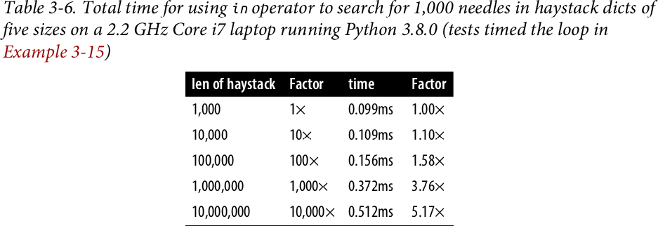

////
[[dict_perf_test_tbl]]
.Tiempo total para usar el operador `in` en la búsqueda de 1.000 agujas en diccionarios pajar de cinco tamaños en una laptop Core i7 de 2,2 GHz con Python 3.8.0 (las pruebas cronometran el bucle de <<ex_for_perf>>)
[options="header"]
|==========================================
|len of haystack| Factor  |dict time|Factor
|         1,000 |      1× | 0.099ms | 1.00×
|        10,000 |     10× | 0.109ms | 1.10×
|       100,000 |    100× | 0.156ms | 1.58×
|     1,000,000 |  1,000× | 0.372ms | 3.76×
|    10,000,000 | 10,000× | 0.512ms | 5.17×
|==========================================
////

En términos concretos, para verificar la presencia de 1.000 claves de punto flotante en un diccionario con 1.000 elementos,
el tiempo de procesamiento en mi laptop fue de 99µs, y la misma búsqueda en un `dict` con 10.000.000 de elementos tomó 512µs.
En otras palabras, el tiempo promedio para cada búsqueda en el pajar con 10 millones de elementos fue de 0,512µs—sí, eso es aproximadamente medio microsegundo por aguja.
Cuando el espacio de búsqueda se volvió 10.000 veces más grande, el tiempo de búsqueda aumentó poco más de 5 veces. Impresionante.

Para comparar con otras colecciones, repetí el benchmark con los mismos pajares de tamaño creciente, pero almacenando `haystack` como `set` o como `list`. Para las pruebas de `set`, además de cronometrar el bucle `for` de <<ex_for_perf>>, también cronometré el one-liner de <<ex_intersect_perf>>, que produce el mismo resultado: contar el número de elementos de `needles` que también están en `haystack`—si ambos son conjuntos.

[[ex_intersect_perf]]
.Usar intersección de conjuntos para contar las agujas que están en el pajar
====
[source, python3]
----
found = len(needles & haystack)
----
====

<<table_dict_set_list_time>> muestra las pruebas lado a lado. Los mejores tiempos están en la columna "set& time", que muestra los resultados para el operador `&` de conjuntos usando el código de <<ex_intersect_perf>>.
Como era de esperar, los peores tiempos están en la columna "list time", porque no hay tabla de hash que soporte búsquedas con el operador `in` en una `list`, por lo que se debe hacer un recorrido completo si la aguja no está presente, lo que resulta en tiempos que crecen linealmente con el tamaño del pajar.

[[table_dict_set_list_time]]
.Tabla 3-7
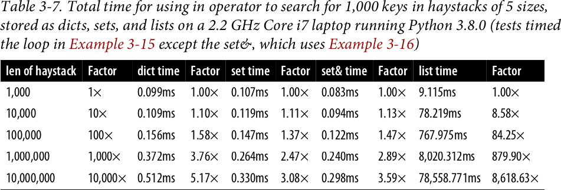

////
[[set_dict_search_time_tbl]]
.Tiempo total para usar el operador in en la búsqueda de 1.000 claves en pajares de 5 tamaños, almacenados como diccionarios, conjuntos y listas, en una laptop Core i7 de 2,2 GHz con Python 3.8.0 (las pruebas cronometran el bucle de <<ex_for_perf>>, excepto set&, que usa <<ex_intersect_perf>>)
[options="header"]
|=========================================================================================================
|len of haystack| Factor  |dict time|Factor |set time |Factor |set& time|Factor | list time    | Factor
|         1,000 |      1× | 0.099ms | 1.00× | 0.107ms | 1.00× | 0.083ms | 1.00× |      9.115ms |     1.00×
|        10,000 |     10× | 0.109ms | 1.10× | 0.119ms | 1.11× | 0.094ms | 1.13× |     78.219ms |     8.58×
|       100,000 |    100× | 0.156ms | 1.58× | 0.147ms | 1.37× | 0.122ms | 1.47× |    767.975ms |    84.25×
|     1,000,000 |  1,000× | 0.372ms | 3.76× | 0.264ms | 2.47× | 0.240ms | 2.89× |  8,020.312ms |   879.90×
|    10,000,000 | 10,000× | 0.512ms | 5.17× | 0.330ms | 3.08× | 0.298ms | 3.59× | 78,558.771ms | 8,618.63×
|=========================================================================================================
////

Si tu programa realiza cualquier tipo de E/S, el tiempo de búsqueda de claves en diccionarios o conjuntos es insignificante, independientemente del tamaño del `dict` o `set` (siempre que quepa en RAM). Ver el código utilizado para generar <<set_dict_search_time_tbl>> y la discusión correspondiente en <<support_scripts>>, <<support_container_perftest>>.

Ahora que tenemos evidencia concreta de la velocidad de los diccionarios y conjuntos, exploremos cómo se logra esto con la ayuda de las tablas de hash.

Antes de estudiar las tablas de hash, necesitamos saber más sobre los códigos hash y cómo se relacionan con la igualdad.

[[hashes_and_equality]]
== Hashes e igualdad

La función integrada `hash()` trabaja directamente con tipos integrados y recurre a llamar a `+__hash__+` para tipos definidos por el usuario. Si dos objetos se comparan como iguales, sus códigos hash también deben ser iguales, de lo contrario el algoritmo de tabla de hash no funciona. Por ejemplo, como `1 == 1.0` es `True`, `hash(1) == hash(1.0)` también debe ser `True`, aunque la representación interna de un `int` y un `float` son muy diferentes.footnote:[Como acabo de mencionar `int`, aquí hay un detalle de implementación de CPython: el código hash de un `int` que cabe en una palabra de máquina es el valor del propio `int`, excepto el código hash de -1, que es -2.]

Además, para ser efectivos como índices de tablas de hash, los códigos hash deben dispersarse por el espacio de índices tanto como sea posible. Esto significa que, idealmente, los objetos que son similares pero no iguales deberían tener códigos hash muy diferentes. <<ex_hashdiff_output>> es la salida de un script para comparar los patrones de bits de los códigos hash. Observa cómo los hashes de 1 y 1.0 son iguales, pero los de 1.0001, 1.0002 y 1.0003 son muy diferentes.

[[ex_hashdiff_output]]
.Comparación de patrones de bits de hash de 1, 1.0001, 1.0002 y 1.0003 en una compilación de Python de 32 bits (los bits que difieren en los hashes de arriba y abajo están resaltados con ! y la columna derecha muestra el número de bits que difieren)
====
[source]
----
32-bit Python build
1        00000000000000000000000000000001
                                          != 0
1.0      00000000000000000000000000000001
------------------------------------------------
1.0      00000000000000000000000000000001
           ! !!! ! !! ! !    ! ! !! !!!   != 16
1.0001   00101110101101010000101011011101
------------------------------------------------
1.0001   00101110101101010000101011011101
          !!!  !!!! !!!!!   !!!!! !!  !   != 20
1.0002   01011101011010100001010110111001
------------------------------------------------
1.0002   01011101011010100001010110111001
          ! !   ! !!! ! !  !! ! !  ! !!!! != 17
1.0003   00001100000111110010000010010110
------------------------------------------------
----
====

[NOTE]
====
A partir de Python 3.3, se incluye un valor de sal aleatorio al calcular los códigos hash para objetos `str`, `bytes` y `datetime`,
como se documenta en https://bugs.python.org/issue13703[Issue 13703—Hash collision security issue].
El valor de sal es constante dentro de un proceso Python pero varía entre ejecuciones del intérprete.
Con PEP-456, Python 3.4 adoptó la función criptográfica SipHash para calcular los códigos hash de objetos `str` y `bytes`.
La sal aleatoria y SipHash son medidas de seguridad para prevenir ataques DoS.
Los detalles están en una nota en la documentación para pass:[<a href="http://bit.ly/1FESm0m">el método especial <code>__hash__</code></a>].
====

[[hash_collisions]]
=== Colisiones de hash

Como se mencionó, en CPython de 64 bits un código hash es un número de 64 bits, y eso son 2^64^ valores posibles—que son más de 10^19^.
Pero la mayoría de los tipos de Python pueden representar muchos más valores diferentes.
Por ejemplo, una cadena de 10 caracteres ASCII imprimibles elegidos al azar tiene 100^10^ valores posibles—más de 2^66^.
Por lo tanto, el código hash de un objeto generalmente tiene menos información que el valor real del objeto.
Esto significa que objetos que son diferentes pueden tener el mismo código hash.

[TIP]
====
Cuando se implementa correctamente, el hashing garantiza que diferentes códigos hash siempre implican objetos diferentes, pero lo contrario no es verdad: diferentes objetos no siempre tienen diferentes códigos hash. Cuando diferentes objetos tienen el mismo código hash, eso es una _colisión de hash_.
====

Con esta comprensión básica de los códigos hash y la igualdad de objetos, estamos listos para explorar cómo funcionan las tablas de hash y cómo se manejan las colisiones de hash.

[[set_hash_tables_under_sec]]
== Las tablas de hash de Set bajo el capó

Las tablas de hash son una invención maravillosa. Veamos cómo se usa una tabla de hash al agregar elementos a un conjunto.

Supongamos que tenemos un conjunto con los días laborables abreviados, creado así:

[source, pycon]
----
>>> workdays = {'Mon', 'Tue', 'Wed', 'Thu', 'Fri'}
>>> workdays
{'Tue', 'Mon', 'Wed', 'Fri', 'Thu'}
----

La estructura de datos central de un `set` de Python es una tabla de hash con al menos 8 filas.
Tradicionalmente, las filas en las tablas de hash se llaman __cubetas__ (buckets)footnote:[La palabra "cubeta" tiene más sentido para describir tablas de hash que contienen más de un elemento por fila.
Python almacena solo un elemento por fila, pero mantendremos el pintoresco término tradicional.].

Una tabla de hash que contiene los elementos de `workdays` se ve como <<fig_hash_table_0>>.

[[fig_hash_table_0]]
.Tabla de hash para el conjunto `{'Mon', 'Tue', 'Wed', 'Thu', 'Fri'}`. Cada cubeta tiene dos campos: el código hash y un puntero al valor del elemento. Las cubetas vacías tienen -1 en el campo de código hash. El orden parece aleatorio.
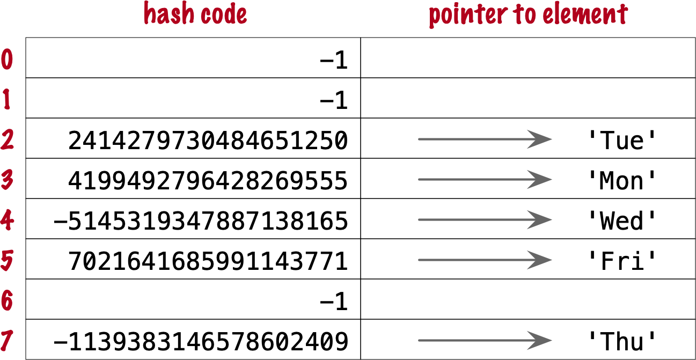

En CPython compilado para una CPU de 64 bits, cada cubeta en un conjunto tiene dos campos:
un código hash de 64 bits, y un puntero de 64 bits al valor del elemento—que es un objeto Python almacenado en otro lugar de la memoria.
Como las cubetas tienen un tamaño fijo, se accede a las cubetas individuales por desplazamiento desde el inicio de la tabla de hash.
En otras palabras, los índices 0 a 7 en <<fig_hash_table_0>> no se almacenan, son solo desplazamientos.

[[hash_table_algorithm_sec]]
=== El algoritmo de tabla de hash

Nos centraremos primero en los internos de `set`, y luego transferiremos los conceptos a `dict`.

[NOTE]
====
Esta es una vista simplificada de cómo Python usa una tabla de hash para implementar un `set`. Para todos los detalles, ver el código fuente comentado para `set` y `frozenset` de CPython en https://github.com/python/cpython/blob/master/Include/setobject.h[Include/setobject.h] y https://github.com/python/cpython/blob/master/Objects/setobject.c[Objects/setobject.c].
====

Veamos cómo Python construye un conjunto como `{'Mon', 'Tue', 'Wed', 'Thu', 'Fri'}`, paso a paso. El algoritmo se ilustra con el diagrama de flujo de <<fig_flowchart_hash_add>>, y se describe a continuación.

[[fig_flowchart_hash_add]]
.Diagrama de flujo para el algoritmo de agregar un elemento a la tabla de hash de un conjunto.
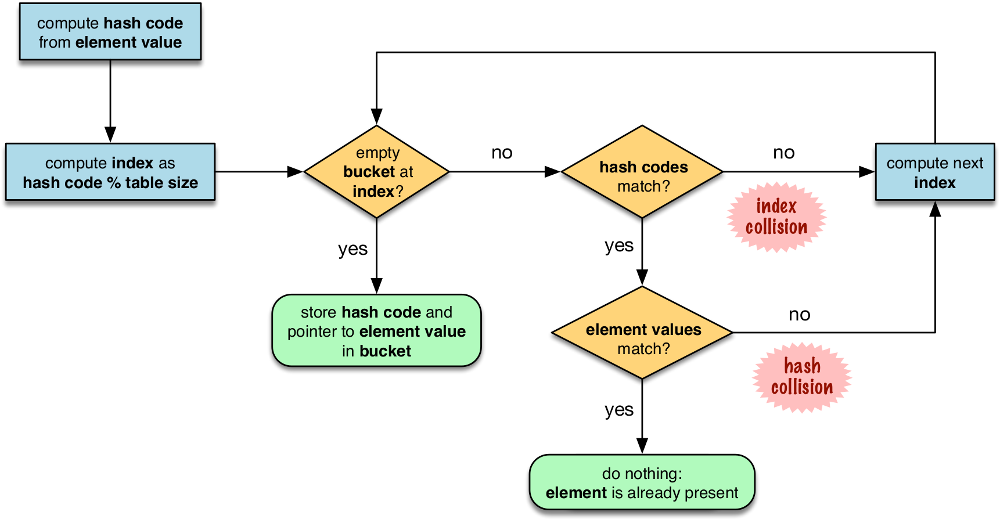

==== Paso 0: inicializar la tabla de hash

Como se mencionó anteriormente, la tabla de hash para un `set` comienza con 8 cubetas vacías. A medida que se agregan elementos, Python se asegura de que al menos ⅓ de las cubetas estén vacías—duplicando el tamaño de la tabla de hash cuando se necesita más espacio. El campo de código hash de cada cubeta se inicializa con -1, que significa "sin código hash"footnote:[La función integrada `hash()` nunca devuelve -1 para ningún objeto Python.
Si `x.__hash__()` devuelve -1, `hash(x)` devuelve -2.].

==== Paso 1: calcular el código hash del elemento

Dado el literal `{'Mon', 'Tue', 'Wed', 'Thu', 'Fri'}`, Python obtiene el código hash del primer elemento, `'Mon'`.
Por ejemplo, aquí hay un código hash realista para `'Mon'`—probablemente obtendrás un resultado diferente debido a la sal aleatoria que Python usa para calcular el código hash de las cadenas:

[source, pycon]
----
>>> hash('Mon')
4199492796428269555
----

==== Paso 2: sondear la tabla de hash en el índice derivado del código hash

Python toma el módulo del código hash con el tamaño de la tabla para encontrar un índice en la tabla de hash. Aquí el tamaño de la tabla es 8, y el módulo es 3:

[source, pycon]
----
>>> 4199492796428269555 % 8
3
----

El sondeo consiste en calcular el índice a partir del hash, luego mirar la cubeta correspondiente en la tabla de hash.
En este caso, Python mira la cubeta en el desplazamiento 3 y encuentra -1 en el campo de código hash, marcando una cubeta vacía.

==== Paso 3: colocar el elemento en la cubeta vacía

Python almacena el código hash del nuevo elemento, 4199492796428269555, en el campo de código hash en el desplazamiento 3, y un puntero al objeto cadena `'Mon'` en el campo del elemento. <<fig_hash_table_1>> muestra el estado actual de la tabla de hash.

[[fig_hash_table_1]]
.Tabla de hash para el conjunto `{'Mon'}`.
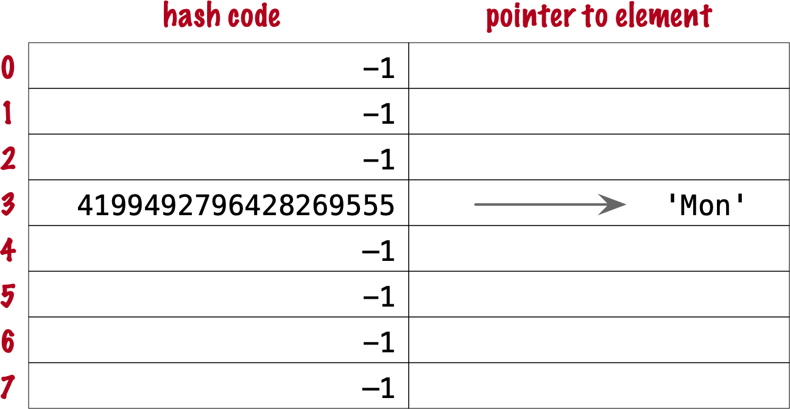

==== Pasos para los elementos restantes

Para el segundo elemento, `'Tue'`, se repiten los pasos 1, 2, 3 anteriores. El código hash para `'Tue'` es 2414279730484651250, y el índice resultante es 2.

[source, pycon]
----
>>> hash('Tue')
2414279730484651250
>>> hash('Tue') % 8
2
----

El hash y el puntero al elemento `'Tue'` se colocan en la cubeta 2, que también estaba vacía. Ahora tenemos <<fig_hash_table_2>>

[[fig_hash_table_2]]
.Tabla de hash para el conjunto `{'Mon', 'Tue'}`. Nota que el orden de los elementos no se preserva en la tabla de hash.
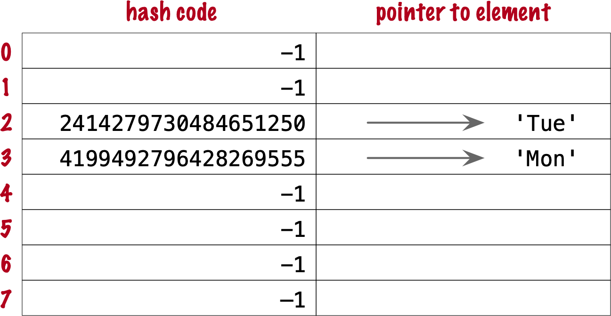

==== Pasos para una colisión

Al agregar `'Wed'` al conjunto, Python calcula el hash -5145319347887138165 y el índice 3.
Python sondea la cubeta 3 y ve que ya está ocupada. Pero el código hash almacenado allí, 4199492796428269555, es diferente.
Como se discutió en <<hashes_and_equality>>, si dos objetos tienen hashes diferentes, entonces sus valores también son diferentes.
Esta es una colisión de índice.
Python entonces sondea la siguiente cubeta y la encuentra vacía.
Así que `'Wed'` termina en el índice 4, como se muestra en <<fig_hash_table_3>>.

[[fig_hash_table_3]]
.Tabla de hash para el conjunto `{'Mon', 'Tue', 'Wed'}`. Después de la colisión, `'Wed'` se coloca en el índice 4.
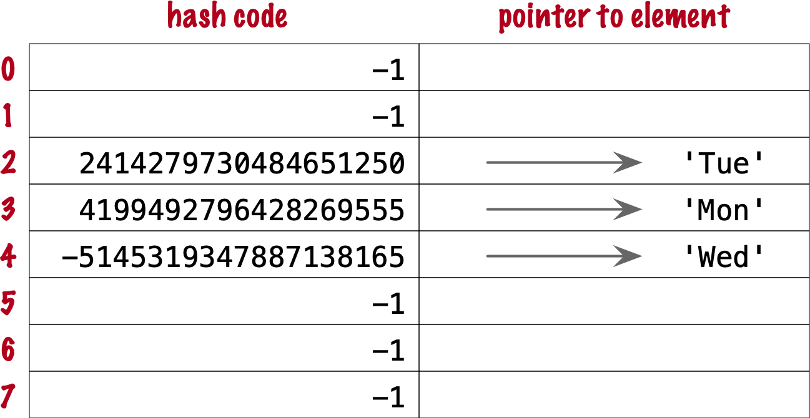

Agregar el siguiente elemento, `'Thu'`, es aburrido: no hay colisión, y cae en su cubeta natural, en el índice 7.

Colocar `'Fri'` es más interesante.
Su hash, 7021641685991143771, implica el índice 3, que está ocupado por `'Mon'`. Al sondear la siguiente cubeta—4—Python encuentra el hash de `'Wed'` almacenado allí. Los códigos hash no coinciden, por lo que esta es otra colisión de índice. Python sondea la siguiente cubeta. Está vacía, así que `'Fri'` termina en el índice 5. El estado final de la tabla de hash se muestra en <<fig_hash_table_4>>.

[NOTE]
====
Incrementar el índice después de una colisión se llama _sondeo lineal_. Esto puede provocar clusters de cubetas ocupadas, lo que puede degradar el rendimiento de la tabla de hash, por lo que CPython cuenta el número de sondeos lineales y, después de cierto umbral, aplica un generador de números pseudoaleatorios para obtener un índice diferente a partir de otros bits del código hash. Esta optimización es particularmente importante en conjuntos grandes.
====

[[fig_hash_table_4]]
.Tabla de hash para el conjunto `{'Mon', 'Tue', 'Wed', 'Thu', 'Fri'}`. Ahora está al 62,5% de capacidad—cerca del umbral de ⅔.

Cuando hay un elemento en la cubeta sondeada y los códigos hash coinciden, Python también necesita comparar los valores reales de los objetos. Esto se debe a que, como se explicó en <<hash_collisions>>, es posible que dos objetos diferentes tengan el mismo código hash—aunque eso es raro para cadenas, gracias a la calidad del algoritmo Siphashfootnote:[En CPython de 64 bits, las colisiones de hash de cadenas son tan infrecuentes que no pude producir un ejemplo para esta explicación. Si encuentras uno, avísame.]. Esto explica por qué los objetos hashables deben implementar tanto `+__hash__+` como `+__eq__+`.

Si se agregara un nuevo elemento a nuestra tabla de hash de ejemplo, estaría más del ⅔ llena, aumentando las posibilidades de colisiones de índice. Para evitar eso, Python asignaría una nueva tabla de hash con 16 cubetas, y reinsertar todos los elementos allí.

Todo esto puede parecer mucho trabajo, pero incluso con millones de elementos en un `set`, muchas inserciones ocurren sin colisiones, y el número promedio de colisiones por inserción está entre uno y dos. En condiciones normales de uso, incluso los elementos con menos suerte pueden colocarse después de resolver un puñado de colisiones.

Ahora, dado lo que hemos visto hasta ahora, sigue el diagrama de flujo de <<fig_flowchart_hash_add>> para responder el siguiente acertijo sin usar la computadora.

Dado el siguiente `set`, ¿qué sucede cuando agregas el entero `1`?

[source, pycon]
----
>>> s = {1.0, 2.0, 3.0}
>>> s.add(1)
----

¿Cuántos elementos hay en `s` ahora? ¿`1` reemplaza al elemento `1.0`?
Cuando tengas tu respuesta, usa la consola de Python para verificarla.

==== Búsqueda de elementos en una tabla de hash

Considera el conjunto `workdays` con la tabla de hash mostrada en <<fig_hash_table_4>>.
¿Está `'Sat'` en él? Esta es la ruta de ejecución más simple para la expresión `'Sat' in workdays`:

. Llamar a `hash('Sat')` para obtener un código hash. Digamos que es 4910012646790914166
. Derivar un índice de tabla de hash del código hash, usando `hash_code % table_size`. En este caso, el índice es 6.
. Sondear el desplazamiento 6: está vacío. Esto significa que `'Sat'` no está en el conjunto. Devolver `False`.

Ahora considera la ruta más simple para un elemento que sí está en el conjunto. Para evaluar `'Thu' in workdays`:

. Llamar a `hash('Tue')`. Supongamos que el resultado es 6166047609348267525.
. Calcular el índice: `6166047609348267525 % 8` es 5.
. Sondear el desplazamiento 5:
.. Comparar los códigos hash. Son iguales.
.. Comparar los valores de los objetos. Son iguales. Devolver `True`.

Las colisiones se manejan de la manera descrita al agregar un elemento.
De hecho, el diagrama de flujo de <<fig_flowchart_hash_add>> también aplica a las búsquedas,
con la excepción de los nodos terminales—los rectángulos con esquinas redondeadas.
Si se encuentra una cubeta vacía, el elemento no está presente, por lo que Python devuelve `False`;
de lo contrario, cuando tanto el código hash como los valores del elemento buscado coinciden con un elemento en la tabla de hash, se devuelve `True`.

[[consequences_set_sec]]
=== Consecuencias prácticas del funcionamiento de los conjuntos

Los tipos `set` y `frozenset` están ambos implementados con una tabla de hash, lo que tiene estos efectos:

* Los elementos del conjunto deben ser objetos hashables. Deben implementar los métodos `+__hash__+` y `+__eq__+` adecuados como se describe en <<what_is_hashable>>.
* Las pruebas de membresía son muy eficientes. Un conjunto puede tener millones de elementos, pero la cubeta para un elemento se puede localizar directamente calculando el código hash del elemento y derivando un desplazamiento de índice, con la posible sobrecarga de un pequeño número de sondeos para encontrar un elemento coincidente o una cubeta vacía.
* Los conjuntos tienen una sobrecarga de memoria significativa. La estructura de datos interna más compacta para un contenedor sería un array de punterosfootnote:[Así se almacenan las tuplas.]. En comparación con eso, una tabla de hash agrega un código hash por entrada, y al menos ⅓ de cubetas vacías para minimizar las colisiones.
* El orden de los elementos depende del orden de inserción, pero no de manera útil ni confiable. Si dos elementos están involucrados en una colisión, la cubeta donde se almacena cada uno depende de cuál elemento se agrega primero.
* Agregar elementos a un conjunto puede cambiar el orden de otros elementos. Esto se debe a que, a medida que la tabla de hash se llena, Python puede necesitar recrearla para mantener al menos ⅓ de las cubetas vacías. Cuando esto sucede, los elementos se reinsertan y pueden ocurrir diferentes colisiones.

[[hash_table_in_dict_sec]]
== Uso de tablas de hash en `dict`

[quote, Brandon Rhodes, in The Dictionary Even Mightier]
____
Que tus hashes sean únicos, +
Que tus claves pocas veces colisionen, +
Y que tus diccionarios +
estén ordenados para siempre.footnote:[Charla de PyCon 2017; video disponible en https://youtu.be/66P5FMkWoVU?t=56]
____

Desde 2012, la implementación del tipo `dict` tuvo dos optimizaciones principales para reducir el uso de memoria.
La primera se propuso como https://www.python.org/dev/peps/pep-0412/[PEP 412 -- Key-Sharing Dictionary] y se implementó en Python 3.3footnote:[Eso fue antes de que empezara a escribir la 1^a^ edición de _Fluent Python_, pero me lo perdí.].
La segunda se llama https://docs.python.org/3/whatsnew/3.6.html#new-dict-implementation["compact `dict`"], y llegó en Python 3.6.
Como efecto secundario, la optimización de espacio del `dict` compacto preserva el orden de inserción de claves.
En las próximas secciones discutiremos el `dict` compacto y el nuevo esquema de compartición de claves—en este orden, para una presentación más sencilla.

[[how_compact_dict_ordering_sec]]
=== Cómo el `dict` compacto ahorra espacio y mantiene el orden

[NOTE]
====
Esta es una explicación de alto nivel de la implementación de `dict` en Python.
Una diferencia es que la fracción utilizable real de una tabla de hash de `dict` es ⅓, y no ⅔ como en los conjuntos.
La fracción real de ⅓ requeriría 16 cubetas para contener los 4 elementos en mi `dict` de ejemplo,
y los diagramas en esta sección se volverían demasiado altos, por lo que pretendo que la fracción utilizable es ⅔ en estas explicaciones.
Un comentario en https://github.com/python/cpython/blob/master/Objects/dictobject.c[Objects/dictobject.c]
explica que cualquier fracción entre ⅓ y ⅔ "parece funcionar bien en la práctica".
====

Considera un `dict` que contiene los nombres abreviados de los días de la semana de `'Mon'` a `'Thu'`, y el número de estudiantes inscritos en la clase de natación en cada día:

[source, pycon]
----
>>> swimmers = {'Mon': 14, 'Tue': 12, 'Wed': 14, 'Thu': 11}
----

Antes de la optimización del `dict` compacto, la tabla de hash subyacente al diccionario `swimmers` se vería como <<fig_hash_table_dict_old>>.
Como puedes ver, en Python de 64 bits, cada cubeta contiene tres campos de 64 bits:
el código hash de la clave, un puntero al objeto clave, y un puntero al objeto valor.
Eso son 24 bytes por cubeta.

[[fig_hash_table_dict_old]]
.Formato antiguo de tabla de hash para un `dict` con 4 pares clave-valor. Cada cubeta es una estructura con el código hash de la clave, un puntero a la clave, y un puntero al valor.
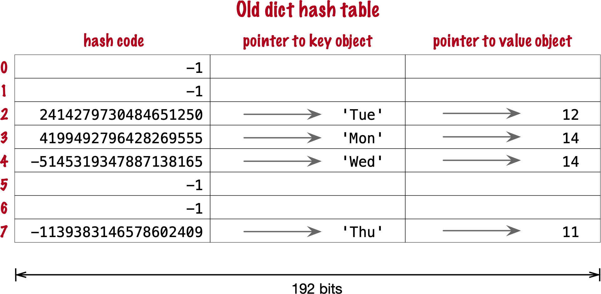

Los primeros dos campos juegan el mismo papel que en la implementación de conjuntos.
Para encontrar una clave, Python calcula el código hash de la clave, deriva un índice de la clave,
luego sondea la tabla de hash para encontrar una cubeta con un código hash coincidente y un objeto clave coincidente.
El tercer campo proporciona la característica principal de un `dict`: mapear una clave a un valor arbitrario.
La clave debe ser un objeto hashable, y el algoritmo de tabla de hash garantiza que sea única en el `dict`.
Pero el valor puede ser cualquier objeto—no necesita ser hashable ni único.

Raymond Hettinger observó que se podrían hacer ahorros significativos si el código hash y los punteros a la clave y al valor se mantuvieran en un array `entries` sin filas vacías,
y la tabla de hash real fuera un array disperso con cubetas mucho más pequeñas que contienen índices al array `entries`footnote:[Es irónico que las cubetas en la tabla de hash aquí no contienen códigos hash, sino solo índices al array `entries` donde están los códigos hash. Pero, conceptualmente, el array `index` es realmente la tabla de hash en esta implementación, aunque no haya hashes en sus cubetas.].
En su https://mail.python.org/pipermail/python-dev/2012-December/123028.html[mensaje original a _python-dev_],
Hettinger llamó a la tabla de hash `indices`. El ancho de las cubetas en `indices` varía a medida que el `dict` crece, comenzando con 8 bits por cubeta—suficiente para indexar hasta 128 entradas, reservando valores negativos para propósitos especiales, como -1 para vacío y -2 para eliminado.

Como ejemplo, el diccionario `swimmers` se almacenaría entonces como se muestra en <<fig_hash_table_dict_compact_4>>.

[[fig_hash_table_dict_compact_4]]
.Almacenamiento compacto para un `dict` con 4 pares clave-valor. Los códigos hash y los punteros a las claves y valores se almacenan en orden de inserción en el array `entries`, y los desplazamientos de entrada derivados de los códigos hash se mantienen en el array disperso `indices`, donde un valor de índice de -1 señala una cubeta vacía.
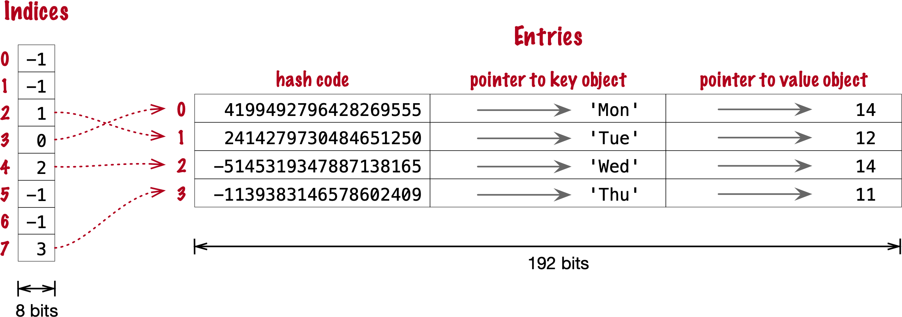

Asumiendo una compilación de 64 bits de CPython, nuestro diccionario `swimmers` de 4 elementos tomaría 192 bytes de memoria en el esquema antiguo:
24 bytes por cubeta, multiplicado por 8 filas.
El `dict` compacto equivalente usa 104 bytes en total: 96 bytes en `entries` (24 * 4),
más 8 bytes para las cubetas en `indices`—configurado como un array de 8 bytes.

La siguiente sección describe cómo se usan esos dos arrays.

==== Algoritmo para agregar elementos al `dict` compacto.

===== Paso 0: configurar `indices`

La tabla `indices` se configura inicialmente como un array de bytes con signo, con 8 cubetas, cada una inicializada con -1 para señalar "cubeta vacía".
Hasta 5 de estas cubetas eventualmente tendrán índices a filas en el array `entries`, dejando ⅓ de ellas con -1.
El otro array, `entries`, contendrá datos de claves/valores con los mismos tres campos que en el esquema antiguo—pero en orden de inserción.

===== Paso 1: calcular el código hash de la clave

Para agregar el par clave-valor `('Mon', 14)` al diccionario `swimmers`,
Python primero llama a `hash('Mon')` para calcular el código hash de esa clave.

===== Paso 2: sondear `entries` a través de `indices`

Python calcula `hash('Mon') % len(indices)`. En nuestro ejemplo, esto es 3.
El desplazamiento 3 en `indices` contiene -1: es una cubeta vacía.

===== Paso 3: colocar el par clave-valor en `entries`, actualizando `indices`.

El array `entries` está vacío, por lo que el siguiente desplazamiento disponible allí es 0.
Python coloca 0 en el desplazamiento 3 en `indices` y almacena
el código hash de la clave, un puntero al objeto clave `'Mon'`, y un puntero al valor `int` `14`
en el desplazamiento 0 en `entries`.
<<fig_hash_table_dict_compact_1>> muestra el estado de los arrays cuando el valor de `swimmers` es `{'Mon': 14}`.

[[fig_hash_table_dict_compact_1]]
.Almacenamiento compacto para `{'Mon': 14}`: `indices[3]` contiene el desplazamiento de la primera entrada: `entries[0]`.
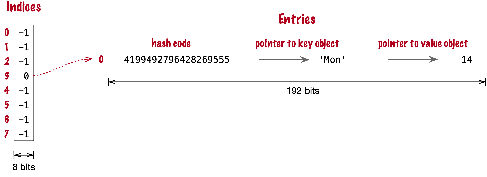

===== Pasos para el siguiente elemento

Para agregar `('Tue', 12)` a `swimmers`:

. Calcular el código hash de la clave `'Tue'`.
. Calcular el desplazamiento en `indices`, como `hash('Tue') % len(indices)`. Esto es 2. `indices[2]` tiene -1. Sin colisión hasta ahora.
. Colocar el siguiente desplazamiento disponible de `entries`, 1, en `indices[2]`, luego almacenar la entrada en `entries[1]`.

Ahora el estado es <<fig_hash_table_dict_compact_2>>. Nota que `entries` mantiene los pares clave-valor en orden de inserción.

[[fig_hash_table_dict_compact_2]]
.Almacenamiento compacto para `{'Mon': 14, 'Tue': 12}`.
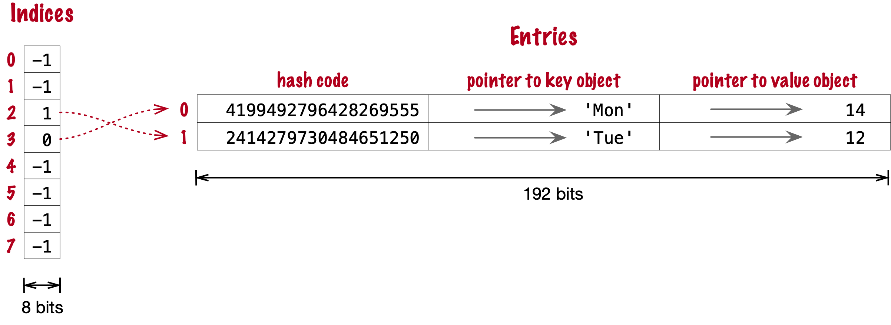

==== Pasos para una colisión

. Calcular el código hash de la clave `'Wed'`.
. Ahora, `hash('Wed') % len(indices)` es 3. `indices[3]` tiene 0, apuntando a una entrada existente.
Ver el código hash en `entries[0]`.
Ese es el código hash de `'Mon'`, que resulta ser diferente al código hash de `'Wed'`.
Esta discrepancia señala una colisión. Sondea el siguiente índice: `indices[4]`.
Ese es -1, por lo que se puede usar.
. Hacer `indices[4] = 2`, porque 2 es el siguiente desplazamiento disponible en `entries`. Luego llenar `entries[2]` como de costumbre.

Después de agregar `('Wed', 14)`, tenemos <<fig_hash_table_dict_compact_3>>

[[fig_hash_table_dict_compact_3]]
.Almacenamiento compacto para `{'Mon': 14, 'Tue': 12, 'Wed': 14}`.
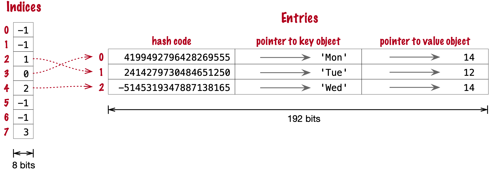

==== Cómo crece un `dict` compacto

Recuerda que las cubetas en el array `indices` son inicialmente 8 bytes con signo, suficientes para contener desplazamientos para hasta 5 entradas, dejando ⅓ de las cubetas vacías.
Cuando se agrega el 6.º elemento al `dict`, `indices` se reasigna a 16 cubetas—suficientes para 10 desplazamientos de entrada.
El tamaño de `indices` se duplica según sea necesario, mientras sigue conteniendo bytes con signo, hasta que llega el momento de agregar el 129.º elemento al `dict`.
En este punto, el array `indices` tiene 256 cubetas de 8 bits. Sin embargo, un byte con signo no es suficiente para contener desplazamientos después de 128 entradas,
por lo que el array `indices` se reconstruye para contener 256 cubetas de 16 bits para contener enteros con signo—suficientemente amplio para representar desplazamientos a hasta 32.768 filas en la tabla `entries`.
El próximo redimensionamiento ocurre en la adición 171, cuando `indices` estaría más del ⅔ lleno.
Entonces el número de cubetas en `indices` se duplica a 512, pero cada cubeta sigue siendo de 16 bits de ancho.
En resumen, el array `indices` crece duplicando el número de cubetas,
y también—con menos frecuencia—duplicando el ancho de cada cubeta para acomodar un número creciente de filas en `entries`.

Esto concluye nuestro resumen de la implementación del `dict` compacto.
Omití muchos detalles, pero ahora veamos la otra optimización de espacio para los diccionarios: la compartición de claves.

[[key_sharing_dict_sec]]
=== Diccionario con compartición de claves

Las instancias de clases definidas por el usuario almacenan sus atributos en un atributo `+__dict__+`footnote:[A menos que la clase tenga un atributo
https://docs.python.org/3/reference/datamodel.html#slots[`+__slots__+`].]
que es un diccionario regular.
Un `+__dict__+` de instancia mapea nombres de atributos a valores de atributos.
La mayor parte del tiempo, todas las instancias tienen los mismos atributos con diferentes valores.
Cuando eso sucede, 2 de los 3 campos en la tabla `entries` para cada instancia tienen exactamente el mismo contenido:
el código hash del nombre del atributo, y un puntero al nombre del atributo.
Solo el puntero al valor del atributo es diferente.

En https://www.python.org/dev/peps/pep-0412/[PEP 412 — Key-Sharing Dictionary],
Mark Shannon propuso dividir el almacenamiento de los diccionarios usados como `+__dict__+` de instancia,
de modo que cada código hash de atributo y puntero se almacene solo una vez, vinculado a la clase,
y los valores de los atributos se mantengan en arrays paralelos de punteros adjuntos a cada instancia.

Dada una clase `Movie` donde todas las instancias tienen los mismos atributos llamados
`'title'`, `'release'`, `'directors'` y `'actors'`,
<<fig_hash_table_dict_split>> muestra la disposición de la compartición de claves en un diccionario dividido
—también implementado con el nuevo diseño compacto.

[[fig_hash_table_dict_split]]
.Almacenamiento dividido para el `+__dict__+` de una clase y tres instancias.
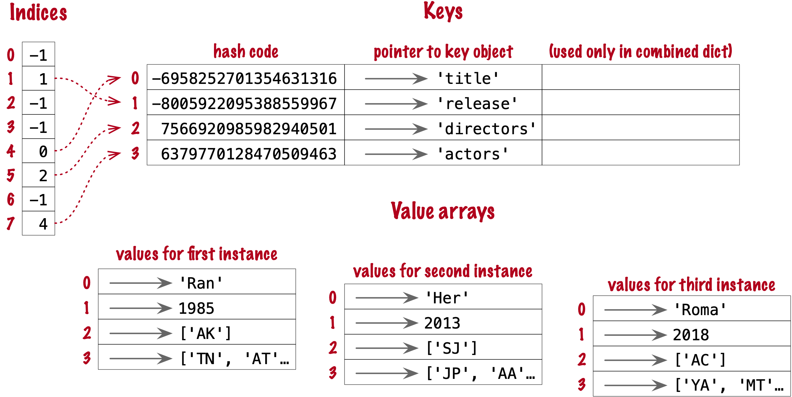

PEP 412 introdujo los términos _combined-table_ para hablar sobre el diseño antiguo y _split-table_ para la optimización propuesta.

El diseño combined-table sigue siendo el predeterminado cuando se crea un `dict` usando sintaxis literal o llamando a `dict()`.
Se crea un diccionario split-table para llenar el atributo especial `+__dict__+` de una instancia, cuando es la primera instancia de una clase.
La tabla de claves (ver <<fig_hash_table_dict_split>>) se almacena en caché en el objeto de la clase.
Esto aprovecha el hecho de que la mayor parte del código Python orientado a objetos asigna todos los atributos de instancia en el método `+__init__+`.
Esa primera instancia (y todas las instancias posteriores) solo mantendrá su propio array de valores.
Si una instancia obtiene un nuevo atributo que no se encuentra en la tabla de claves compartida, entonces el `+__dict__+` de esta instancia se convierte a la forma combined-table.
Sin embargo, si esta instancia es la única en su clase, el `+__dict__+` se convierte de vuelta a split-table,
ya que se asume que las instancias futuras tendrán el mismo conjunto de atributos y la compartición de claves será útil.

La estructura `PyDictObject` que representa un `dict` en el código fuente de CPython es la misma para los diccionarios tanto _combined-table_ como _split-table_.
Cuando un `dict` se convierte de un diseño a otro, el cambio ocurre en los campos de `PyDictObject`,
con la ayuda de otras estructuras de datos internas.

[[consequences_dict_sec]]
=== Consecuencias prácticas del funcionamiento de dict

* Las claves deben ser objetos hashables. Deben implementar los métodos `+__hash__+` y `+__eq__+` adecuados como se describe en <<what_is_hashable>>.
* Las búsquedas de claves son casi tan rápidas como las búsquedas de elementos en conjuntos.
* El orden de los elementos se preserva en la tabla `entries`—esto se implementó en CPython 3.6, y se convirtió en una característica oficial del lenguaje en 3.7.
* Para ahorrar memoria, evita crear atributos de instancia fuera del método `+__init__+`. Si todos los atributos de instancia se crean en `+__init__+`,
el `+__dict__+` de tus instancias usará el diseño split-table, compartiendo los mismos índices y array de entradas de clave almacenados con la clase.
